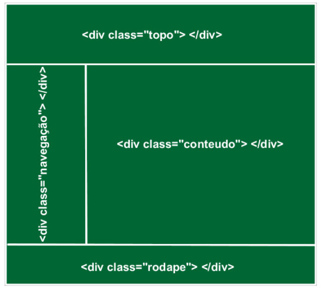
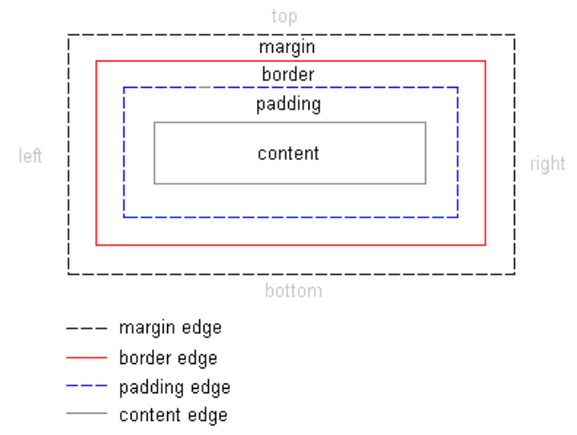
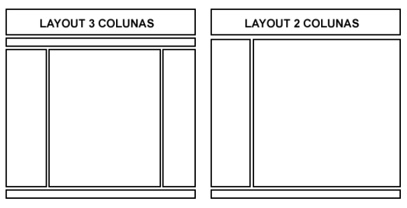
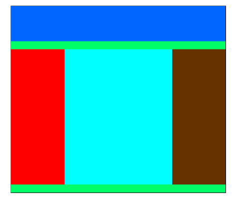

# CSS - Cascading Style Sheets - Aula 2

## O elemento DIV

A tag DIV define uma divisão ou um seção em um documento HTML.

- DIV não causa nenhuma diferença visual no código.

- O DIV é considerada um "container", ou seja, uma espécie de "caixa" não visual que você pode incluir em seu conteúdo outros elementos HTML. 

- O DIV é utilizado para aplicar um estilo (CSS) em todo o bloco HTML contido dentro dele.

```css
<div id=“esporte”> </div>
<div id=“economia> </div>
```

- Os sites atuais estão sendo produzidos, com a utilização de uma coleção de mais e mais elementos div, em substituição às tabelas que eram usadas para criar o layout.

- Para cada DIV é criada uma classe ou id no código CSS, que contém o estilo associado ao HTML. 

<p align="center">

</p>

## O box-model CSS

- Todo elemento HTML é uma "caixa" retangular a ser apresentada na tela com as estilizações determinadas pelas regras CSS.

- As caixas são empilhadas uma após a outra e constituídas de margens, bordas, espaçamentos e o conteúdo propriamente dito.

- O box model é a especificação que define como o elemento e os seus atributos se relacionam entre si.

- Cabeçalhos (\<h1>,\<h2>,\<h3>..), parágrafos (\<p>), listas (\<ul>, \<ol>),formulários (\<form>), divisões (\<div>), e qualquer elemento HTML (tag) é representado por uma caixa.

- A caixa é a unidade básica de formatação CSS.

- As caixas podem conter ou estar contidas dentro de outras caixas. 

- As caixas CSS são constituídas por 04 (quatro) áreas retangulares, que se desenvolvem de dentro para fora, na
ordem listada abaixo:

  - conteúdo;
  - espaçamentos (padding);
  - bordas (border);
  - margens (margin).

<p align="center">

</p>

- A margin é invisível, não possui cor de fundo e não esconde elementos.

- A border permite visualizar os limites visíveis da box.

- O padding define o espaço entre o conteúdo e o border.

- A única parte visível da box apresentada na imagem seria o border, portanto toda a zona tracejada não estaria visível.

#### Exemplo 

Código CSS de uma classe chamada .box:

```css
.box {
    width: 100px;
    height: 50px;
    border: 10px solid #ccc;
    padding: 20px;
    margin: 20px;
}
```

Código HTML:

```html
<p class="box">CONTEÚDO</p>
```

### Unidades de medidas

- As unidades de medidas que podem ser relativas ou absolutas.

- Unidades absolutas são unidades de medida de comprimento definidas nos sistemas de medidas pela física, por exemplo centímetros, milímetros, polegadas, etc. 

- Medidas absolutas são:

  - in = polegada
  - cm = centímetro
  - mm = milímetro
  - pt = ponto

#### Exemplos

```css
div { margin: 2.5cm; }

h4 { margin: 2mm; }

p { font-size: 10pt; }

.classe { padding: 3pt; }

hr { width: 14pt; }

h1 { margin: 1in; }
```

- As unidades de medida relativas são aquelas que tomam como base um valor de referência e são mais apropriadas para ajustes de uso em diferentes tipos de mídia. 

- As quatro unidades de medida relativa são:

  - em = 1em é igual ao tamanho de fonte definido para o elemento em questão

  - ex = 1ex é igual a altura da letra xis minúscula(x) da fonte definida

  - px = pixel

  - % = uma medida relativa previamente definida

#### Exemplos

```css
div { margin: 1.5em; }

h4 { margin: 2ex; }

p { font-size: 14px; }

.classe { padding: 90%; }

h1 { line-height: 1.2em }

p { font-size: 10px }
```

### Propriedades para margens

As propriedades para margens definem valores para espessura das margens dos elementos HTML.

As propriedades para margens são as listadas abaixo:

- margin-top: define a margem superior;

- margin-right: define a margem direita;

- margin-bottom: define a margem inferior;

- margin-left: define a margem esquerda;

- margin: maneira abreviada para todas as margens.

Os valores possíveis para as propriedades das margens são:

- auto: valor default da margem

- length: uma medida reconhecida pelas CSS (px, pt, em, cm, ...)

- %: porcentagem da largura do elemento pai

#### Exemplo

```css
.box {
    margin-top: 20px;
    margin-right: 30mm;
    margin-bottom: 5pt;
    margin-left: 3in;
}
```

- São válidos valores negativos para margem, com o objetivo de sobrepor um elemento.

- A propriedade `margin` admite a sintaxe abreviada, a qual consiste em declarar uma lista de valores separados por um espaço.

- Há quatro modos de se declarar abreviadamente as margens:

  - margin: valor1 - as 4 margens terão valor1;

  - margin: valor1  valor2 - margem superior e inferior terão valor1 - margem direita e esquerda terão valor2

  - margin: valor1  valor2  valor3 - margem superior terá valor1 - margem direita e esquerda terão valor2 - margem inferior terá valor3

  - margin: valor1  valor2 valor3 valor4 - margens superior, direita, inferior e esquerda nesta ordem.

#### Exemplos

```css
.box {
    margin: 20px; /* margem de 20px nos quatro lados */
    margin: 15px 10px; /* margem superior e inferior de 15px e direita e esquerda de 10px */
    margin: 15px 5px 10px; /* margem superior 5px, direita e
esquerda 5px e inferior de 10px */
    margin: 15px 5px 10px 20px; /* margem superior 5px, direita 5px, inferior 10px e esquerda de 20px */
}
```

### Propriedades para espaçamentos

As propriedades para espaçamentos definem valores para os espaçamentos entre o conteúdo e as bordas dos elementos HTML.

As propriedades para espaçamentos são as listadas abaixo:

- padding-top: define a espaçamento superior;

- padding-right: define a espaçamento direita;

- padding-bottom: define a espaçamento inferior;

- padding-left: define a espaçamento esquerda;

- padding: maneira abreviada para todas os espaçamentos.

Os valores possíveis para as propriedades dos espaçamentos são:

- auto: valor default do espaçamento

- length: uma medida reconhecida pelas CSS (px, pt, em, cm, ...)

- %: porcentagem da largura do elemento pai

#### Exemplos

```css
.box {
    padding-top: 20px;
    padding-right: 30px;
    padding-bottom: 5px;
    padding-left: 10px;
}
```

- A propriedade padding também admite a sintaxe abreviada, a qual consiste em declarar uma lista de valores separados por um espaço. 

- Há quatro modos de se declarar abreviadamente os espaçamentos:

  - padding: valor1 - os 4 espaçamentos terão valor1;

  - padding : valor1 valor2 - espaçamento superior e inferior terão valor1 - espaçamento direita e esquerda terão valor2

  - padding : valor1 valor2 valor3 - espaçamento superior terá valor1 -espaçamento direita e esquerda terão valor2 - espaçamento inferior terá valor3

  - padding : valor1  valor2  valor3  valor4 - espaçamento superior, direita, inferior e esquerda nesta ordem.


#### Exemplos

```css
.box {
    padding: 20px; /* espaçamento de 20px nos quatro lados */
    padding : 15px 10px; /* espaçamento superior e inferior de
15px e direita e esquerda de 10px */
    padding : 15px 5px 10px; /* espaçamento superior 5px,
direita e esquerda 5px e inferior de 10px */
    padding : 15px 5px 10px 20px; /* espaçamento superior 5px,
direita 5px, inferior 10px e esquerda de 20px */
}
```

### Propriedades para bordas

As propriedades para bordas definem a espessura, a cor e o estilo das bordas do box. 

As propriedades para as bordas são as listadas abaixo:

- border-width: espessura da borda

- border-style: estilo da borda

- border-color: cor da borda

Cada uma destas três características da borda pode ser declarada separadamente para cada lado do box, conforme abaixo:

- Borda superior:

  - border-top-width: espessura da borda superior

  - border-top-style: estilo da borda superior

  - border-top-color: cor da borda superior

- Borda direita:

  - border-right-width: espessura da borda direita

  - border-right-style: estilo da borda direita

  - border-right-color: cor da borda direita

- Borda inferior:

  - border-bottom-width: espessura da borda inferior

  - border-bottom-style: estilo da borda inferior

  - border-bottom-color: cor da borda inferior

- Borda esquerda:

  - border-left-width: espessura da borda esquerda

  - border-left-style: estilo da borda esquerda

  - border-left-color: cor da borda esquerda

Podemos ainda abreviar a propriedade border da seguinte forma:

- border-top: maneira abreviada para todas as propriedades da borda superior

- border-right: maneira abreviada para todas as propriedades da borda direita

- border-bottom: maneira abreviada para todas as propriedades da borda inferior

- border-left: maneira abreviada para todas as propriedades da borda esquerda

- border: maneira abreviada para todas as quatro bordas

#### Exemplos

```css
p {
    border-style: solid;
    border-bottom-style: dashed;
    border-color:#00FF33;
    border-top-color:#FF00BB;
    border-bottom-width: 10px;
    border-top-width: 0px; border-right-width: 0px;
    border-left-width: 0px;
}
```

Podemos declarar todas as três propriedades das bordas em uma regra única. A
sintaxe geral é:

```css
border: size style color
```

#### Exemplo

```css
p { border: thick groove #FF0033 }
```

As propriedades estudadas também podem ser empregas para estilização de tabelas:

```css
table {
    border-style:solid;
    border-color:#0066FF;
    border-width:2px;
}

tr td,tr th {
    border-style:solid;
    border-color:#0099FF;
    border-width:1px;
}
```

## Exercícios práticos

**Questão 01.** Criar uma regra CSS para formatação de parágrafo com as seguintes
configurações:

- Largura do parágrafo: 150px;
- Altura do parágrafo: 100px;
- Cor da fonte branca
- Tipo de fonte Arial
- Cor de fundo verde
- Borda Superior: Espessura de 2px, na cor azul e estilo dashed.
- Borda Esquerda: Espessura de 2px, na cor amarela e estilo dotted.
- Borda Inferior: Espessura de 2px, na cor vermelha e estilo double.
- Borda Direita: Sem borda
- Espaçamento Superior e Esquerda: 10px

Ao final adicione um texto ao parágrafo e verifique se o resultado apresentado está de
acordo com a formatação sugerida.

## Estilização de textos, listas e pseudo-elementos

### Estilização de textos

As propriedades para textos, definem as características dos textos inseridos dentro dos
elementos HTML:

- color: cor do texto;

- text-align: alinhamento do texto;

- text-decoration: decoração do texto;

- text-indent: recuo do texto;

- text-transform: forma das letras;

- direction: direção do texto;

- letter-spacing: espaçamento entre letras;

- word-spacing: espaçamento entre palavras;

Em relação ao alinhamento, temos a propriedade `text-align` que controla o posicionamento horizontal do conteúdo de um elemento nível de bloco. 

Os valores possíveis são:

- left
- right
- center
- justify
- inherit(um valor herdado).

Esta propriedade coloca os textos às esquerda, direita, centralizado ou justificados em
relação ao container onde está localizado. 

#### Exemplo

```css
.centro {text-align:center;}

.direita {text-align:right;}

.esquerdo {text-align:left;}

.justificado {text-align:justify;}
```

Outra propriedade de alinhamento é a `text-indent` que define uma indentação para
primeira linha do texto contida em um bloco. 

Para configurá-lo, adicionamos uma medida de comprimento, porcentagem ou um valor herdado.

#### Exemplo

CSS

```css
.exemplo{text-indent:100px;}
```

HTML
```html
<p class=“exemplo”>Onononono</p>
```

Além de controlar espaçamentos e alinhar textos, podemos utilizar as propriedades CSS para adicionar uma série de efeitos em textos.

A propriedade `text-decoration` que causa um efeito decorativo no texto. Os valores possíveis desse efeito são:

- none(sem decoração)

- underline

- overline

- line-through

- blink

#### Exemplos

CSS

```css
.linhacortando{text-decoration:line-through;}

.duaslinhas{text-decoration: overline underline;}

.piscar{text-decoration:blink;}
```

HTML

```html
<p class="linhacortando">Linha cortando</p>
<p class="duaslinhas">Duas linhas</p>
<p class="piscar">Piscar</p>
```

Outro efeito em texto é a propriedade `text-transform` que controle os efeitos de capitalização dos textos.

Os valores possíveis dessa propriedade são:

- none

- capitalize (primeiro caractere em caixa alta);

- uppercase (todos os caracteres em caixa alta);

- lowercase (caracteres em caixa baixa)

- inherit

#### Exemplo

```css
p{text-transform:capitalize;}
```

A propriedade `text-shadow` é utilizada para aplicar uma sombra a um texto.

A propriedade text-shadow é usada da seguinte maneira:

#### Exemplo

```css
text-shadow: 2px 2px 2px #00f;
```

- Os dois primeiros valores são as coordenadas top left, para onde a sombra será projetada. O terceiro valor é o efeito blur da sombra e o quarto valor é a cor da sombra.

Por último temos ainda a propriedade `direction` controla a direção do texto e apresenta os seguintes valores:

- ltr: texto escrito da esquerda para a direita

- rtl: texto escrito da direita para a esquerda

#### Exemplo

```css
p {
    direction:rtl;
}
```

As regras CSS dispõem de mecanismos para controle de espaçamentos em fontes e textos, seja na vertical quanto na horizontal. 

Para controlar o espaçamento entre letras e parágrafos de um texto utilizamos as propriedades:

- letter-spacing

- word-spacing

- line-height

A propriedade `letter-spacing` controla o espaçamento entre letras de um texto. 

#### Exemplo

```css
p {
    letter-spacing:10px;
}
```

A propriedade `word-spacing` controla o espaçamento entre as palavras de um texto.

#### Exemplo

```css
p {
    word-spacing:30px;
}
```

A propriedade `line-height` controla a altura dos blocos contidos dentro de um elemento nível de bloco.

#### Exemplo

```css
p {
    line-height:30px;
}
```

### Estilização de listas

As listas HTML podem ser utilizadas para a criação de menus CSS.

Para alterar a aparência do marcador de uma lista, usamos a propriedade: `list-style-type`.

Podemos alterar para três tipos: glifos, sistema númerico, sistem alfabético.

#### Exemplo

```css
ul {
    list-style-type:circle;
}
```

Podemos retirar os marcadores padrão de lista com o uso do valor none, como mostrado abaixo:

#### Exemplo

```css
ol, ul {list-style-type:none;}
```

Além dos tipos padrões de marcador de uma lista, podemos definir uma pequena imagem como marcador de uma lista.

Essa propriedade substitui automaticamente o marcador padrão por uma imagem construída.

#### Exemplo

```css
ul {
    list-style-image:url(target.png);
    font-weight:bold;
    color:#FF0000;
}
```

Por último, existe a propriedade `list-style-position` que define a posição do box que contém o marcador da lista em relação ao box principal do elemento li. 

Os valores possíveis são: 

- outside

- inside 

- inherit

### Pseudo-elementos

Pseudo-classes e pseudo-elementos são usados em CSS, para adicionar efeitos a um seletor, ou a parte de um seletor.

A sintaxe dos pseudo-elementos é:

```css
seletor:pseudo-elemento {propriedade: valor;}
```

Na estilização de textos, os dois pseudoelementos mais comuns são:

- first-letter

- first-line

O pseudo-elemento `first-letter` é usado para obter um efeito especial na primeira letra de um texto.

#### Exemplo

```css
p:first-letter
{
    font-size:300%;
    color:#6666FF ;
    font-weight:bold;
    border-width:2px;
    border-style:solid;
    border-color:#009966;
}
```

O pseudo-elemento `first-line` é usado para obter um efeito especial na primeira linha de um texto.

#### Exemplo

```css
p:first-line
{
    color: #0000FF;
    font-variant: small-caps;
    text-decoration:overline;
    font-family:"Courier New", Courier, monospace;
}
```

O elemento âncora juntamente com o atributo href têm a função de criar links em um documento. 

Para estilizarmos links em uma página, é fundamental a utilização de pseudo-classes.

As pseudo-classes são elementos que complementam seletores e a maioria das pseudo-classes são dinâmicas, ou seja, o efeito produzidos por elas depende de interação com o usuário.

São quatro as pseudoclasses para links:

|Pseudoclasses|Estado do link |
| --- | --- |
|a\:link |Link no estado inicial|
|a:visited|Link visitado|
|a:hover|Estado do link quando o usuário passa o ponteiro do mouse sobre ele|
|a:active|Estado do link quando o usuário clica sobre ele|

Os navegadores normalmente apresentam links não visitados na
cor em tonalidade azul, os visitados na cor púrpura e também os destacam com um sublinhado.

Para retirar o sublinhado padrão dos links, teremos que usar a propriedade `text-decoration` definida como o valor none.

#### Exemplo

```css
a:link,a:visited {
    text-decoration:none;
}
```

Após ter retirado o sublinhado do link no seu estado inicial, é comum definir um estilo devolvendo o sublinhado quando o usuário passa o ponteiro do mouse sobre ele. 

Para isso usaremos as pseudoclasses hover e active.

#### Exemplo

```css
a:hover,a:active
{
    text-decoration:underline;
}
```

Além de alterar o sublinhado, podemos alterar cor, fundo, fonte entre outras propriedades css usando estas pseudoclasses.

Para criar um efeito rollover simples podemos definir uma cor de
fundo para o estado hover do link. 

#### Exemplo

```css
a:link,a:visited {
    text-decoration:none;
    border-width:1px;
    border-color:#000000;
    border-style:solid;
    background-color:#009900;
    color:#FFFF00
}

a:hover,a:active
{
    text-decoration:none;
    border-width:1px;
    border-color:#000000;
    border-style:solid;
    background-color:#FFFF00;
    color:#009900
}
```

As pseudoclasses podem ser utilizadas em qualquer seletor CSS.

Podem ser aplicados várias regras CSS aos efeitos HOVER em links, a citar:

- Alterar plano de fundo
- Alterar tamanho da fonte do texto
- Alterar fonte

## Exercícios práticos

**Questão 02.** Criar uma regra CSS para formatação de parágrafos utilizando as seguintes configurações:

- Borda Esquerda: Espessura de 20em, na cor verde e estilo solid.
- Borda Direita: Espessura de 20em, na cor vermelha e estilo solid.
- Largura: 60%
- Altura: 400px;
- Tamanho da fonte: 12px;
- Espaçamento entre letras: 3em;
- Espaçamento entre palavras: 4ex;
- Altura dos blocos: 3em;
- Alinhamento do texto: justificado
- Tipo de fonte Verdana
- Indentação do texto: 25px;

Por fim adicione aos pseudo-elementos `firstletter` e `firstline`,as seguintes configurações:

- firstletter
  - Tamanho da Fonte: 36px
  - Cor da fonte: azul
  - Decoração do texto: overline

- firstline
  - Decoração do texto: underline
  - Capitalização do texto: todos os caracteres em caixa alta

**Questão 03.** Criar regras css para os seguintes links:

a) Link em estado inicial sem sublinhado

b) Link em estado inicial com sublinhado acima do texto, em estado ativo com uma linha passando ao meio do texto, e em estado visitado com sublinhado abaixo do texto

c) Link em estado inicial na cor laranja e em estado hover na cor verde e sublinhado

d) Link em estado inicial com bordas com estilo solida e cor azul, fundo preto e cor da fonte branco; e em estado hover com bordas com estilo pontilhadas e cor preto, fundo branco e cor da fonte preto

e) Link em estado inicial de cor vermelha; estado visitado em itálico e negrito na cor laranja; estado hover sublinhado, e quando o usuário clicar no link a cor deverá ser amarelo.

Para cada regra acima, crie uma classe ou id e em seguida associe-as para os links criados. A regra CSS deverá ser criada de forma interna.


## Posicionamento e layout com CSS

### Posicionamento

Existem quatro tipos de posicionamento em CSS: estático, relativo,absoluto e fixo. 

A propriedade CSS que possibilita posicionar um elemento qualquer é a propriedade `position`. 

Esta propriedade deverá receber um dos valores referentes aos
quatro tipo de posicionamento CSS.

**Posicionamento Estático**

O posicionamento estático é definido pelo valor `static` da propriedade position.

```css
elemento { position: static }
```

Um elemento posicionado estaticamente segue o fluxo normal dos elementos da página, ou seja, se posiciona abaixo do elemento imediatamente anterior e acima do imediatamente posterior, quando nenhum destes está posicionado de outra forma que não a estática.

Como o posicionamento estático é o padrão, não é necessário escrever regras para esse tipo de posicionamento.

**Posicionamento Absoluto**

O posicionamento absoluto é definido pelo valor `absolute` da propriedade position. 

```css
elemento{ position:absolute }
```

Quando um elemento é posicionado absolutamente, sua posição é computada de acordo com a posição do elemento “posicionado” mais próximo, que o contém.

Elemento “posicionado” é qualquer elemento que tenha seu posicionamento definido como relativo, absoluto ou fixo. 

Quando não há nenhum elemento “posicionado”, a posição é computada com relação ao elemento body.

Na regra CSS, ao definir a posição absolute utilizamos as propriedades `left` que define o quanto a imagem dista da margem esquerda e a propriedade `top` que define o quanto a imagem dista do topo.

#### Exemplo

```css
img {
    position:absolute;
    top:100px;
    left:100px;
}
```

Podemos também alterar as referências do elemento posicionado, mudando as propriedades para `right` (direita) e `bottom` (inferior). Dessa forma, podemos fazer combinações para os quatro cantos da tela.

Qualquer unidade de medida CSS pode ser usada para posicionar, inclusive medidas relativas como são aquelas expressas em porcentagens.

Considere a marcação HTML a seguir. Para marcação HTML foi desenvolvida duas regras CSS.

HTML

```html


```

CSS

```css
#pos1{
    position:absolute;
    top:100px;
    left:0px;
}

#pos2{
    position:absolute;
    top:100px;
    left:0px;
}
```

Como as duas id criadas possuem posicionamento absoluto, e o
posicionamento a esquerda é de 100px, as imagens se sobrepõem, ou seja são posicionadas uma em cima da outra.

Para que as imagens não sejam sobrepostas, podemos alterar o código CSS para a seguinte forma:

```css
#pos2{
    position:absolute;
    top:100px;
    left:143px;}
```

Como a imagem apresenta largura de 143px, o posicionamento a esquerda da segunda imagem estará configurado com 143px, de forma que aparecerá logo em seguida a apresentação da primeira imagem.

**Posicionamento Relativo**

Especificando position como relativo podemos utilizar top ou bottom, right ou left para posicionar os elementos na página em relação ao lugar que ele ocuparia no fluxo do documento. 

Veja a regra CSS para a posição relative para o exemplo apresentado anteriormente.

```css
#pos1{
    position:relative;
    top:100px;
    left:0px;
}

#pos2{
    position:relative;
    top:100px;
    left:0px;
}
```

Quando foi utilizado o posicionamento absoluto, as imagens apareceram sobrepostas, já que elas estavam posicionadas a 0px do elemento que as contém (o elemento body).

Com o posicionamento relativo, a primeira imagem aparecerá a 0(zero) px do elemento anterior (body), e a segunda imagem aparecerá a 0px do elemento anterior(imagem1).

Considere a seguinte marcação HTML:

```html
<div id="div1">
<div id="div2"></div>
</div>
```

Se definirmos uma regra CSS `position: relative` para a div1 e `position: absolute` para a div2, a partir de agora a div2 se posicionará absolutamente em relação a div1, não mais em relação ao body da página.

Dessa forma ao configurarmos as propriedades: left, top, bottom e right, elas serão configuradas em relação a div1.

**Posicionamento Fixo**

O esquema de posicionamento fixo, posiciona um elemento fixadamente na página em relação a janela, ou seja, independente de a pagina conter um scroll ou não, o elemento sempre ficará visível ao usuário em relação as medidas definidas.

O posicionamento fixo é definido pelo valor fixed da propriedade position.

```css
elemento {position:fixed }
```

Da mesma forma que o posicionamento relativo e absoluto, deverá também ser configurado as propriedades left,right,top e bottom.

## Layout

O primeiro passo para construir um layout CSS é definir como será o design da página. 

O design de uma página pode ser feito em ferramentas(Fireworks, CorelDrawn, Photoshop) apropriadas pra criação de design de páginas WEB ou mesmo em uma folha de papel.

<p align="center">

</p>

Em nosso exemplo construiremos um layout 3 colunas. 

A estrutura HTML para definir as seções do layout consistirá de divs e para cada div será definida regras CSS para posiciona-las.

```html
<div id="containerGeral">
<div id="cabecalho"> </div>
<div id="menu"> </div>
<div id="le"> </div>
<div id="centro"> </div>
<div id="ld"> </div>
<div id="rodape"> </div>
</div>
```

O código do containerGeral e do cabeçalho ficará assim:

```css
#containerGeral
{
    position:relative;
    width:800px;
    height:auto;
    border:1px solid #000;
    margin:0 auto;
}

#cabecalho
{
    width:800px;
    height:130px;
    background-color:#06F;
}
```

O containerGeral deverá ter uma regra de posicionamento. 

Usaremos o posicionamento do fluxo do documento (relativo).

A regra `margin: 0 auto;` configurará a margem superior e inferior para o valor 0 e a esquerda e direita para automática, neste caso a página ficará centralizada.

O menu, rodapé e lateral esquerda ficarão assim:

```css
#menu,#rodape
{
    width:800px;
    height:30px;
    background-color:#0F6;
}

#le
{
    width:200px;
    height:500px;
    background-color:#F00;
}
```

O centro e a lateral direita possuem a seguinte codificação CSS: 

```css
#centro
{
    width:400px;
    height:500px;
    background-color:#0FF;
    position:absolute;
    top:160px;
    left:200px;
}

#ld
{
  width:200px;
  height:500px;
  background-color:#630;
  position:absolute;
  top:160px;
  left:600px;
}
```

Resultado:

<p align="center">

</p>